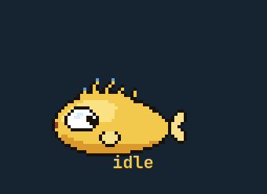

<div align="center">



# Jarvis

**Un assistant vocal qui tient dans un fichier bash.**

Claude comme cerveau, le shell comme mains,
et un poisson de Babel en pixel art comme visage.

Enregistrer → transcrire → réfléchir → parler tourne sur n'importe quelle
machine Linux : PipeWire, Python 3, voxtype, Claude Code, Piper. Seuls ses
mains et son visage ont besoin d'Omarchy.

[**Documentation**](https://macarchy.github.io/jarvis/index.fr.html) · [**Pilote la machine à états**](https://macarchy.github.io/jarvis/machine.fr.html) · [English](README.md)

</div>

---

```
SUPER + ALT + J          appuie pour parler, appuie encore pour la réponse
« Hey Jarvis »           pareil, sans toucher au clavier
SUPER + ALT + ESCAPE     arrête ce qui est en cours
```

Dis « mets le thème clair » et le thème change. Demande « pourquoi ma dernière
commande a échoué ? » et il lit ton historique de shell et te répond. Dis
« corrige le bug de scroll dans mon projet web » et il lance une session de
code en arrière-plan, puis vient te dire ce qu'elle a donné.

Il répond dans la langue que tu as parlée. Il se souvient d'hier. Quand il ne
peut pas faire quelque chose, il note pourquoi — et plus tard, quand il
s'ennuie, il relit ces notes et les distille en leçons qu'il garde.

## Ce qui vaut la peine d'être volé ici

Même sans jamais le faire tourner, quatre choses de ce dépôt sont faites pour
être lues et reprises :

- **Une machine à états qui ne peut pas s'éloigner de sa documentation.** Huit
  états, neuf événements, 38 couples légaux sur 72 — écrits en prose au-dessus
  du code dans [`bin/jarvis-fsm.sh`](bin/jarvis-fsm.sh) et gelés dans une
  fixture de test, pour que la table et le paragraphe qui l'explique tombent
  ensemble ou pas du tout.
  [Pilote-la dans ton navigateur.](https://macarchy.github.io/jarvis/machine.fr.html)

- **Une annulation qui annule vraiment.** Le fichier d'état dit *ce que* fait
  la machine ; un dossier à côté dit *quelle tentative* le fait. Chaque étape
  porte l'époque à laquelle elle a commencé et se tait si celle-ci a bougé.
  Chaque étape externe tourne dans son propre groupe de processus, parce que
  tuer le groupe est ce qui atteint les sous-processus que `claude` a lancés
  pour ses propres outils — un pid nu ne les atteint jamais, et c'est pour ça
  qu'annuler ne faisait longtemps rien du tout.

- **Une mémoire qui se consolide toute seule.** Les échecs sont notés au
  moment où ils arrivent. Quand il s'ennuie, une session séparée les relit et
  les distille en leçons qui deviennent une part de sa personnalité. Les
  interruptions vont dans un autre fichier, exprès : une seule ligne dans le
  journal des échecs suffisait à programmer une session qui réécrit sa
  personnalité, donc appuyer sur une touche fabriquait des changements de
  caractère permanents.

- **Une suite de tests pour un assistant vocal.** Plus de 250 assertions,
  entièrement hors ligne : un faux cerveau, une fausse voix, un faux micro qui
  meurt vraiment sur un signal. Aucun quota, aucun réseau, aucun son, aucun
  micro pris.

---

## Est-ce que ça tournera chez toi ?

Honnêtement : **en partie**, sauf si ta machine ressemble beaucoup à la
mienne. Jarvis est fait de trois couches, et elles tombent indépendamment —
autant savoir laquelle tu récupères.

| Couche | Ce qu'elle apporte | Ce qu'elle exige |
|---|---|---|
| **La boucle vocale** | enregistrer → transcrire → réfléchir → parler : toute la conversation | Linux, PipeWire, [voxtype](https://voxtype.io), [Claude Code](https://claude.com/claude-code), [Piper](https://github.com/rhasspy/piper), Python 3 — **portable** |
| **Les mains** | changer le thème, la luminosité, le réseau, les fenêtres, lancer des applications | [Omarchy](https://omarchy.org) et Hyprland — leur CLI *est* ses mains |
| **Le corps** | le poisson dans le coin, la bulle, la barre d'écriture | [Quickshell](https://quickshell.org) via `omarchy-shell` |

La première couche tourne partout où il y a un micro. Les deux autres sont
écrites contre un bureau précis et ne prétendent pas le contraire : chaque
appel vers elles est en `|| true`, donc sur un Linux ordinaire Jarvis écoute,
réfléchit et parle toujours — il n'a simplement rien à toucher et pas de
visage à faire.

La machine de référence est un **MacBook Pro M2 sous Asahi Linux** avec
[macarchy](https://github.com/macarchy) (Omarchy plus une couche à la macOS).
`bootstrap.sh` récupère une build Piper `arm64` ou `amd64` selon l'endroit où
tu le lances.

Il te faut aussi un compte Claude : le cerveau est `claude -p`, appelé une
fois par échange. Rien d'autre dans la chaîne ne quitte la machine.

## Installation

```sh
git clone https://github.com/macarchy/jarvis.git ~/Work/jarvis
cd ~/Work/jarvis
./bootstrap.sh      # Piper, ses voix, le modèle Whisper, le venv du réveil
./install.sh        # le lien de commande, le greffon du shell, les unités
omarchy-jarvis doctor
```

`bootstrap.sh` télécharge ~300 Mo que le dépôt ne porte délibérément pas (voir
[THIRD_PARTY.md](THIRD_PARTY.md)) ; il reprend un téléchargement interrompu, et
le relancer ne récupère rien de plus. `install.sh` est idempotent lui aussi —
le relancer est la façon prévue de mettre à jour après un `git pull`.

`doctor` est la réponse à « est-ce que ça marche ? » : chaque dépendance, vert
ou rouge, sans deviner. Pour chaque ligne rouge,
[docs/troubleshooting.fr.md](docs/troubleshooting.fr.md) explique quoi faire.

`claude` et `voxtype` s'installent à part : ils ont leurs propres comptes et
leur propre configuration, ce n'est pas à Jarvis de les gérer.

## Ce qui quitte ta machine

C'est plus important que la liste des fonctions, donc c'est ici et pas en
annexe. La version longue est dans [docs/privacy.fr.md](docs/privacy.fr.md).

- **Ta parole est transcrite en local.** Whisper tourne sur ton processeur.
  L'audio ne sort jamais de la machine, et l'enregistrement est écrasé par le
  suivant.
- **Ton transcript part chez Anthropic**, puisque le cerveau est Claude par
  défaut — sauf si tu le fais répondre en local, voir « Le cerveau local »
  plus bas, auquel cas plus rien ne sort. Et
  avec lui tout ce que Claude lit pour te répondre — ce qui peut inclure une
  capture d'écran ou ton presse-papier, mais **uniquement quand tu le demandes
  dans l'échange en cours**, jamais de sa propre initiative, et chaque usage
  est tracé.
- **Le daemon de réveil tient le micro ouvert** tant qu'il tourne. Il est
  optionnel (`--skip-wake`), il compare l'audio en local à un petit modèle, et
  il n'enregistre rien tant qu'il ne s'est pas déclenché.
- **Tout ce qu'il fait est écrit** dans `memory/trace/` : chaque commande,
  chaque résultat. C'est ce qui lui permet de répondre à « pourquoi as-tu fait
  ça ? ». C'est aussi un journal en clair de ta journée, sur ton disque.

Tu peux couper toute son autonomie depuis `SOUL.md` : `rondes: non` arrête
l'inspection horaire, `reves: non` la consolidation de mémoire, et
`silence: 23-7` lui donne des heures où il ne fait rien sans qu'on le lui
demande.

## Les réflexes

Certaines demandes n'ont jamais eu besoin d'un modèle. « Quelle heure
est-il » se répond avec `date`, en deux cents millisecondes, exactement.

`memory/REFLEXES.md` est une table de quatre colonnes séparées par des
tabulations — motif, commande, slot, phrase parlée — lue avant le cerveau.
Le motif est une expression rationnelle ancrée sur le transcript entier,
exactement comme `memory/NOISE.md` : c'est ce qui garde « pourquoi le son
est-il si fort ? » loin de la commande de volume.

Elle existe surtout pour une raison. Hors ligne, à « quelle heure est-il »,
le modèle local a répondu « Il est 14h37 » à 23 h passées, avec aplomb,
dans le format parlé exact de Jarvis. Une valeur plausible et fausse est
pire qu'un refus. Ce que `date` ou `/sys` savent dire exactement, le
cerveau n'a plus le droit de le deviner.

```
omarchy-jarvis reflexe? "quelle heure est-il"          # quelle rangée matche
omarchy-jarvis reflexe? --run "quelle heure est-il"    # et ce qu'elle dirait
```

Le fichier est à toi : ajoute, retire, corrige. `omarchy-jarvis doctor`
refuse une table mal formée, et une commande destructrice y est rejetée au
chargement — la table ne passe pas par `.claude/settings.json`, c'est sa
seule porte.

## Le cerveau local

Par défaut Jarvis pense avec Claude, ce qui demande le réseau. Il sait aussi
parler à n'importe quel serveur compatible OpenAI — llama-server, LM Studio,
Ollama, LocalAI, vLLM — et donc répondre dans un avion.

Trois lignes dans `SOUL.md`, sous « Réglages » :

```
- cerveau: auto          # auto | nuage | local
- cerveau-url: http://127.0.0.1:8099
- cerveau-modele: Qwen3.5-4B
```

`cerveau-modele` a deux rôles : c'est l'identifiant envoyé au serveur —
llama-server l'ignore, LM Studio et Ollama en ont besoin — et c'est aussi
ce que Jarvis prononce quand on lui demande avec quel cerveau il pense.
Mets-y le vrai nom de ton modèle.

`auto` suit l'état du nuage : Claude tant qu'il répond, le modèle local dès
qu'il ne répond plus, et une nouvelle tentative vers le nuage toutes les dix
minutes (`JARVIS_BRAIN_RETRY`). Le Control Center a la même bascule dans
« Âme », et dit vers où va la parole en ce moment.

**Ce qu'il perd hors ligne.** Le cerveau local n'a aucun outil : pas de Bash,
pas de lecture d'écran, pas de recherche web. Il ne peut donc ni agir sur la
machine, ni lire l'heure, la batterie ou la météo — et
`memory/OFFLINE_PROMPT.md` lui interdit explicitement de les inventer, parce
que sans cette consigne un modèle de 4 milliards de paramètres répond « il
est 14h37 » à 23 h, avec aplomb. Ce qu'il garde : parler, expliquer,
traduire, raconter, se souvenir du fil en cours.

**Monter le serveur.** Sur ce MacBook M2 sous Asahi, llama.cpp compilé avec
le backend Vulkan (pilote Honeykrisp) va environ 1,7 fois plus vite que le
CPU en prefill et 1,3 fois en génération. Avec un modèle 4B en Q4_K_M, la
première phrase sort en une à trois secondes.

```
systemctl --user enable --now jarvis-brain.service
```

L'unité est installée par `install.sh` mais jamais activée toute seule.
`--reasoning off` y est obligatoire : un modèle « thinking » envoie sa
réflexion dans `reasoning_content`, épuise son budget de tokens et ne dit
jamais un mot.

## Comment ça marche

Une phrase, cinq étapes, chacune avec une poignée sur disque pour pouvoir être
arrêtée :

```
appui ─▶ pw-record ─▶ voxtype (whisper) ─▶ claude -p ─▶ piper ─▶ pw-play
          record          stt                brain       voice    play
```

En dessous vit une machine à états explicite — huit états, neuf événements, et
seulement 38 des 72 couples sont légaux. Elle est dans
[`bin/jarvis-fsm.sh`](bin/jarvis-fsm.sh), écrite en prose au-dessus du code, et
gelée dans `tests/fixtures/transitions.txt` : elle ne peut pas s'éloigner de sa
propre documentation sans rendre un test rouge.

**[La machine, en pilotable](https://macarchy.github.io/jarvis/machine.fr.html)** —
appuie sur les événements, regarde le poisson changer, et regarde les coups
illégaux être refusés avec leur raison. Trente secondes là-bas valent mieux
que cette section.

Ce qui est bon à voler si tu construis quelque chose d'approchant : le fichier
d'état dit *ce que* fait la machine, et un dossier à côté dit *quelle
tentative* le fait. Chaque étape retient l'époque à laquelle elle est entrée et
se tait si elle a changé. Ça, plus le fait de lancer chaque étape externe dans
son propre groupe de processus, est ce qui rend l'annulation vraie — tuer le
groupe est ce qui atteint les sous-processus que `claude` a lancés pour ses
propres outils, ce qu'un pid nu ne fait jamais.

**Touch Bar** — avec [macarchy-dfr](https://github.com/macarchy/macarchy-dfr)
installé, le plugin est aussi un `touchbar-module` : le poisson s'installe
sur la barre elle-même, là où était la touche micro — un appui pour
déclencher, un appui long pour ouvrir sa page du Control Center. La barre
est à lui pendant qu'il travaille : elle se remplit d'un vumètre pendant
qu'il écoute (nourri par le daemon de réveil), tape le transcript au fur
et à mesure qu'il réfléchit, et tape sa réponse au fur et à mesure qu'elle
est parlée ; une ✕ interrompt. `bin/jarvis` et `jarvis-wake.py` publient
via `macarchy-dfr macarchy.jarvis state|heard|reply|level|emote|abort` —
rien de différent de la machine à états qui signale n'importe quel autre
auditeur. `install.sh` copie [`plugin/touchbar.py`](plugin/touchbar.py)
avec le reste du plugin, et le daemon le récupère au prochain
`macarchy-dfr reload`.

## Le faire tien

[`SOUL.md`](SOUL.md), c'est qui il est — le ton, l'humour, le tutoiement ou le
« monsieur », sa langue, **laquelle des trois voix françaises le porte**, ses
heures de silence, et les cinq pièces dont son poisson est assemblé. Édite-le librement ; ça s'applique à la conversation
suivante.

[`CLAUDE.md`](CLAUDE.md), c'est ce qu'il sait faire — les commandes qui sont ses
mains, écrites comme un prompt. Ajouter une capacité, c'est en général un
paragraphe là-dedans et une ligne dans `.claude/settings.json`.

« Hey Jarvis » est entraîné sur de l'anglais natif. Prononce-le à l'anglaise
(*héï djâ-vis*) ; un accent français naturel passe sous le radar du modèle. Un
clone frais n'a pas de vérificateur d'accent, donc le seuil est à `0,30` —
entraîne le tien avec `wake/train-verifier` et il monte à `0,8`.

## Développement

```sh
./tests/run        # toute la chaîne, entièrement hors ligne
```

La suite bouchonne `claude`, `piper`, `voxtype`, `pw-record`, `pw-play` et
`omarchy-shell`, et redirige l'état et la mémoire dans un bac à sable. Elle ne
prend pas le micro, ne fait aucun bruit, ne dépense aucun token et ne touche
jamais ta vraie mémoire. Si elle fait l'une de ces choses, c'est un bug.

[CONTRIBUTING.md](CONTRIBUTING.md) donne le style de la maison et les règles
qui gardent la machine honnête.

## Licence

MIT — voir [LICENSE](LICENSE). Les morceaux téléchargés ont leurs propres
licences ; [THIRD_PARTY.md](THIRD_PARTY.md) les liste.
